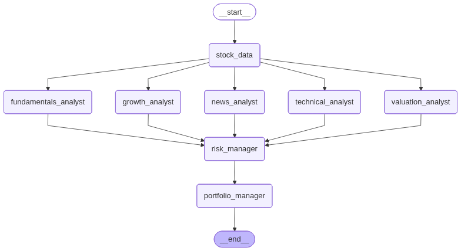

# Deer Trade - 智能股票分析系统

Deer Trade 是一个基于 LangChain 和 LangGraph 构建的智能股票分析系统，提供多维度的股票投资分析功能。

## 🚀 功能特性

### 核心分析模块
- **估值分析** - 使用多种估值方法（P/E、P/B、P/S、EV/EBITDA、DCF等）
- **技术分析** - 技术指标、图表模式、趋势分析
- **基本面分析** - 财务数据、盈利能力、偿债能力分析
- **增长分析** - 收入增长、利润增长、市场份额分析
- **新闻分析** - 市场情绪、新闻事件影响分析
- **风险管理** - 风险评估、波动性分析、风险控制
- **投资组合管理** - 资产配置、风险分散建议

## 🏗️ 系统架构



```
deer-trade/
├── src/
│   ├── config/          # 配置管理
│   ├── graph/           # 工作流图构建
│   ├── llms/           # LLM 管理
│   ├── prompts/         # 分析提示词模板
│   └── workflow.py      # 工作流入口
├── main.py              # 主程序入口
└── pyproject.toml       # 项目配置
```

## 📦 安装依赖

```bash
# 使用 uv 或 pip 安装依赖
uv install
# 或
pip install -e .
```

## 🎯 快速开始

### 基本使用

```python
import asyncio
import json

from src.workflow import graph


async def main():
    res = await graph.ainvoke(input={"stock_code": "300308.SH", "start_date": "20251020", "end_date": "20251023"})
    print(json.dumps(res, indent=4, ensure_ascii=False))
    return res


if __name__ == "__main__":
    asyncio.run(main())
```

### 配置说明

在运行前，请确保配置好以下环境变量：

```bash
export DEEPSEEK_API_KEY="your_deepseek_api_key"
export OPENAI_API_KEY="your_openai_api_key"
```

## 📋 示例分析

以下是一个完整的股票分析示例（中际旭创 300308.SH），请参考文件：[示例文件](./examples/中际旭创.md)。

## 🔧 配置选项

### 支持的股票代码格式
- 美股代码：AAPL, GOOGL, TSLA 等
- 港股代码：0700.HK, 9988.HK 等
- A股代码：000001.SZ, 600036.SH 等

### 分析参数配置

可以通过修改 `src/config/` 目录下的配置文件来自定义分析参数：
- 估值倍数范围
- 技术指标参数
- 风险偏好设置
- 分析时间范围

## 📊 输出格式

系统返回结构化的分析结果，包含：

### 估值分析输出
- 估值评分（1-10分）
- 公允价值估计
- 估值倍数对比
- 投资建议

### 技术分析输出
- 技术评分（1-10分）
- 关键支撑/阻力位
- 交易信号
- 风险/收益比

## 🛠️ 开发指南

### 添加新的分析模块

1. 在 `src/prompts/` 目录下创建新的提示词模板
2. 在 `src/graph/nodes.py` 中添加对应的分析节点
3. 在 `src/graph/builder.py` 中配置工作流连接

### 自定义提示词

所有分析提示词使用 Jinja2 模板，支持动态变量注入：

```jinja2
Current Date: {{ current_date }}
Stock Code: {{ stock_code }}
```

## 📈 性能优化

- 使用异步处理提高并发性能
- 支持批量股票分析
- 结果缓存机制
- 可配置的分析深度

## 致谢

本项目使用了 [FinanceMCP](https://github.com/guangxiangdebizi/FinanceMCP) 提供的金融数据MCP服务，为股票分析提供了强大的数据支持。

## 🤝 贡献指南

欢迎提交 Issue 和 Pull Request 来改进项目！

## 📄 许可证

MIT License

## 📞 支持

如有问题请提交 Issue 或联系开发团队。